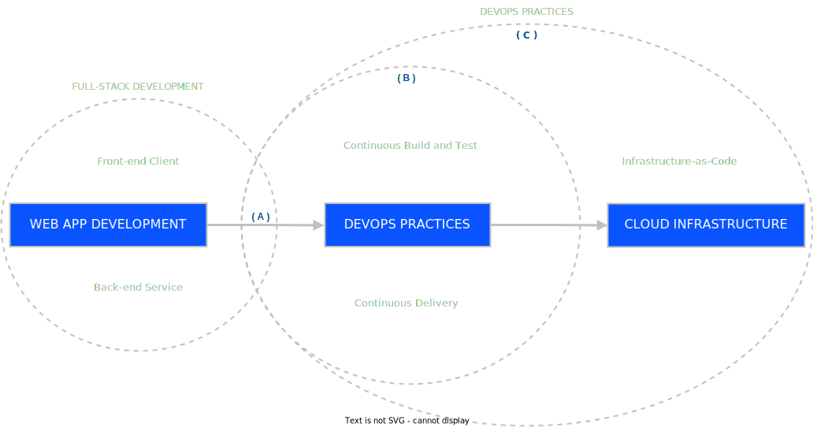

A portfolio website that aims to empower individuals to learn from their experiences and continuously improve themselves, both personally and professionally. Individuals can unlock their full potential and achieve their goals by committing to ongoing learning and being willing to embrace new experiences. This page strives to inspire and support this journey of self-discovery and growth.

This website aims to share insights and learning resources based on below primary learning target and scope:

#### Web Application Development

Web App Development is the process of creating dynamic and interactive software applications accessible through web and mobile browsers. It involves designing, coding, testing, and deploying applications that can run on different devices and platforms connected to the internet. It encompasses a range of technologies and frameworks and focuses on delivering user-friendly interfaces, efficient data management, and secure communication between the client and server.

#### DevOps Practices

DevOps Practices are processes that combines integral process of software development and IT operations to streamline the software development lifecycle, which emphasizes collaboration, automation, and continuous delivery, enabling organizations to deliver software applications more efficiently and reliably. It involve close cooperation between development and operations teams, breaking down silos and fostering a culture of shared responsibility. And by integrating development and operations, it aims to improve software quality, accelerate time to market, and enhance overall business agility.

#### Cloud Infrastructure

Cloud infrastructure refers to the set of technologies and practices used to deploy and manage applications in the cloud. Cloud infrastructure component includes servers, storage, networking, and architecture patterns such as microservices, serverless, and containers.
